# Development Guide

## Table of Contents
- [Getting Started](#getting-started)
- [Editor Setup](#editor-setup)
- [Troubleshooting](#troubleshooting)
- [Pre-Commit Hooks (Husky)](#pre-commit-hooks-husky)
- [CI Workflow (GitHub Actions)](#ci-workflow-github-actions)
- [CI/CD Integration](#cicd-integration)
- [Testing](#testing)

## Getting Started

### Prerequisites

- Node.js 18+
- npm or yarn
- React Native CLI
- iOS/Android development environment

### Installation

```bash
# Install dependencies
npm install

# iOS specific
cd ios && pod install && cd ..

# Start Metro bundler
npm start

# Run on device/simulator
npm run android
npm run ios
```

## Editor Setup

### VS Code Configuration

Create `.vscode/settings.json`:

```json
{
  "editor.formatOnSave": true,
  "editor.defaultFormatter": "esbenp.prettier-vscode",
  "editor.codeActionsOnSave": {
    "source.fixAll.eslint": true
  },
  "eslint.validate": [
    "javascript",
    "javascriptreact",
    "typescript",
    "typescriptreact"
  ],
  "typescript.tsdk": "node_modules/typescript/lib",
  "typescript.enablePromptUseWorkspaceTsdk": true
}
```

### Recommended Extensions

Install these VS Code extensions:

- **ESLint** (dbaeumer.vscode-eslint)
- **Prettier** (esbenp.prettier-vscode)
- **React Native Tools** (msjsdiag.vscode-react-native)
- **TypeScript** (Built-in)

### Keyboard Shortcuts

```
Cmd/Ctrl + Shift + P → "TypeScript: Restart TS Server"
Cmd/Ctrl + Shift + P → "ESLint: Fix all auto-fixable Problems"
Cmd/Ctrl + Shift + P → "Format Document"
```

## Troubleshooting

### Common Issues

#### Issue: "Cannot find module '@/constants/colors'"

**Solution 1: Check tsconfig.json**
```json
{
  "compilerOptions": {
    "baseUrl": ".",
    "paths": {
      "@/*": ["src/*"]
    }
  }
}
```

**Solution 2: Restart TypeScript Server**
```
VS Code: Cmd/Ctrl + Shift + P → "TypeScript: Restart TS Server"
```

**Solution 3: Clear Metro Cache**
```bash
npm run reset
```

---

#### Issue: "Parsing error: Cannot read file 'tsconfig.json'"

**Solution: Verify tsconfig.json exists**
```bash
# Check configuration
npx tsc --showConfig

# Run type check
npm run type-check
```

---

#### Issue: ESLint not finding plugins

**Solution: Reinstall dependencies**
```bash
# Remove node_modules
rm -rf node_modules

# Clear cache and reinstall
npm cache clean --force
npm install
```

---

#### Issue: Prettier conflicts with ESLint

**Solution: Run in order**
```bash
# Fix ESLint issues first
npm run lint:fix

# Then format with Prettier
npm run format

# Or combine
npm run lint:fix && npm run format
```

---

#### Issue: Metro bundler errors

**Solution: Clear all caches**
```bash
# Clear Metro cache
npm run reset

# Clear watchman cache (macOS/Linux)
watchman watch-del-all

# Clear iOS build
cd ios && rm -rf Pods Podfile.lock && pod install && cd ..

# Clear Android build
cd android && ./gradlew clean && cd ..
```

---

#### Issue: TypeScript errors after update

**Solution: Update types and restart**
```bash
# Update TypeScript
npm install typescript@latest --save-dev

# Update types
npm install @types/react@latest @types/react-native@latest --save-dev

# Restart TS server
# VS Code: Cmd/Ctrl + Shift + P → "TypeScript: Restart TS Server"
```

### Platform-Specific Issues

#### iOS

```bash
# Clear derived data
rm -rf ~/Library/Developer/Xcode/DerivedData

# Reinstall pods
cd ios && rm -rf Pods Podfile.lock && pod install && cd ..

# Clean build
cd ios && xcodebuild clean && cd ..
```

#### Android

```bash
# Clear gradle cache
cd android && ./gradlew clean && cd ..

# Clear build folder
rm -rf android/build android/app/build

# Reset ADB
adb kill-server && adb start-server
```

## Pre-Commit Hooks (Husky)

### Setup

This project uses Husky for Git hooks and lint-staged for automatic code fixes.

**Initial Setup:**

```bash
# 1. Install dependencies (if not already installed)
npm install --save-dev husky lint-staged

# 2. Initialize Husky (creates .husky folder)
npx husky install

# 3. Make pre-commit hook executable
chmod +x .husky/pre-commit

# 4. Test the hook
git add .
git commit -m "test: verify pre-commit hook"
```

### How Pre-Commit Works

```mermaid
graph LR
    A[git commit] --> B[Husky intercepts]
    B --> C[lint-staged runs]
    C --> D{Auto-fixes applied?}
    D -->|Yes| E[Type-check runs]
    D -->|No| F[Commit blocked]
    E --> G{Type errors?}
    G -->|No| H[Commit succeeds ✅]
    G -->|Yes| F
```



**Process:**
1. You run `git commit -m "message"`
2. Husky intercepts and runs `.husky/pre-commit`
3. lint-staged auto-fixes ESLint and Prettier issues on staged files
4. TypeScript type-check validates entire project
5. If all pass → commit proceeds
6. If any fail → commit is blocked with error messages

### Configuration Files

**`.husky/pre-commit`**
```bash
#!/usr/bin/env sh
. "$(dirname -- "$0")/_/husky.sh"

echo "🔍 Running pre-commit checks..."
npx lint-staged
npm run type-check
echo "✅ All pre-commit checks passed!"
```

**`package.json` (lint-staged config)**
```json
{
  "lint-staged": {
    "*.{js,jsx,ts,tsx}": [
      "eslint --fix",
      "prettier --write"
    ],
    "*.{json,md}": [
      "prettier --write"
    ]
  }
}
```

### Common Scenarios

#### Scenario 1: Successful Commit

```bash
$ git commit -m "feat: add new feature"

🔍 Running pre-commit checks...
🎯 Running lint-staged (auto-fix for staged files)...
✔ Preparing lint-staged...
✔ Running tasks for staged files...
✔ Applying modifications from tasks...
📘 Running TypeScript type check...
✅ All pre-commit checks passed!

[main abc1234] feat: add new feature
 3 files changed, 45 insertions(+), 2 deletions(-)
```

#### Scenario 2: Auto-Fixed Issues

```bash
$ git commit -m "fix: update component"

🔍 Running pre-commit checks...
🎯 Running lint-staged (auto-fix for staged files)...
✔ Preparing lint-staged...
✔ Running tasks for staged files...
  ✔ src/MyComponent.tsx
    ✔ eslint --fix [MODIFIED]
    ✔ prettier --write [MODIFIED]
✔ Applying modifications from tasks...
📘 Running TypeScript type check...
✅ All pre-commit checks passed!

[main def5678] fix: update component
 1 file changed, 10 insertions(+), 5 deletions(-)
```

#### Scenario 3: Blocked Commit (Type Error)

```bash
$ git commit -m "feat: new feature"

🔍 Running pre-commit checks...
🎯 Running lint-staged (auto-fix for staged files)...
✔ Complete
📘 Running TypeScript type check...

src/MyComponent.tsx:25:5 - error TS2322: Type 'string' is not assignable to type 'number'.

❌ TypeScript check failed.
💡 Fix type errors and try again.

# Fix the error, then commit again
$ npm run type-check  # Verify fix
$ git commit -m "feat: new feature"
```

### Bypassing Hooks

**When to bypass:**
- Emergency hotfix in production
- Temporary WIP commit (use with caution)
- CI/CD automated commits

**How to bypass:**

```bash
# Method 1: --no-verify flag
git commit --no-verify -m "emergency: critical fix"

# Method 2: Environment variable (single command)
HUSKY=0 git commit -m "skip hooks"

# Method 3: Disable for session
export HUSKY=0
git commit -m "first commit"
git commit -m "second commit"
unset HUSKY
```

**⚠️ Warning:** Only bypass hooks when absolutely necessary. It defeats the purpose of code quality enforcement.

## Troubleshooting

### Common Issues

#### Issue: "Cannot find module '@/constants/colors'"

**Solution 1: Check tsconfig.json**
```json
{
  "compilerOptions": {
    "baseUrl": ".",
    "paths": {
      "@/*": ["src/*"]
    }
  }
}
```

**Solution 2: Restart TypeScript Server**
```
VS Code: Cmd/Ctrl + Shift + P → "TypeScript: Restart TS Server"
```

**Solution 3: Clear Metro Cache**
```bash
npm run reset
```

---

#### Issue: "Parsing error: Cannot read file 'tsconfig.json'"

**Solution: Verify tsconfig.json exists**
```bash
# Check configuration
npx tsc --showConfig

# Run type check
npm run type-check
```

---

#### Issue: ESLint not finding plugins

**Solution: Reinstall dependencies**
```bash
# Remove node_modules
rm -rf node_modules

# Clear cache and reinstall
npm cache clean --force
npm install
```

---

#### Issue: Prettier conflicts with ESLint

**Solution: Run in order**
```bash
# Fix ESLint issues first
npm run lint:fix

# Then format with Prettier
npm run format

# Or combine
npm run lint:fix && npm run format
```

---

#### Issue: Metro bundler errors

**Solution: Clear all caches**
```bash
# Clear Metro cache
npm run reset

# Clear watchman cache (macOS/Linux)
watchman watch-del-all

# Clear iOS build
cd ios && rm -rf Pods Podfile.lock && pod install && cd ..

# Clear Android build
cd android && ./gradlew clean && cd ..
```

---

#### Issue: TypeScript errors after update

**Solution: Update types and restart**
```bash
# Update TypeScript
npm install typescript@latest --save-dev

# Update types
npm install @types/react@latest @types/react-native@latest --save-dev

# Restart TS server
# VS Code: Cmd/Ctrl + Shift + P → "TypeScript: Restart TS Server"
```

### Platform-Specific Issues

#### iOS

```bash
# Clear derived data
rm -rf ~/Library/Developer/Xcode/DerivedData

# Reinstall pods
cd ios && rm -rf Pods Podfile.lock && pod install && cd ..

# Clean build
cd ios && xcodebuild clean && cd ..
```

#### Android

```bash
# Clear gradle cache
cd android && ./gradlew clean && cd ..

# Clear build folder
rm -rf android/build android/app/build

# Reset ADB
adb kill-server && adb start-server
```

## CI Workflow (GitHub Actions)

### Overview

Automated code quality checks are performed using GitHub Actions.  
The workflow is defined in `.github/workflows/ci.yml`.

**What it does:**
- Installs dependencies with Node.js 20.x
- Caches `node_modules` for faster builds
- Runs lint, type-check, and format jobs in parallel
- Triggers on push to `main`/`develop` and all pull requests
- Supports manual runs via `workflow_dispatch`

### How to Use

- **Automatic:** Runs on every push and pull request.
- **Manual:** Go to the Actions tab in GitHub, select "CI", and click "Run workflow" to trigger manually.

**Jobs:**
- `lint`: Runs ESLint
- `type-check`: Runs TypeScript type-check
- `format`: Checks Prettier formatting

### Troubleshooting

If CI fails on `npm ci`:
- Ensure your `package-lock.json` is up to date (`npm install` locally, then commit and push).
- Make sure your dependencies support Node.js 20.x.

See `.github/workflows/ci.yml` for configuration details.

## CI/CD Integration

### Pre-commit Hook (Husky)

**Installation:**
```bash
npm install --save-dev husky lint-staged

# Initialize husky
npx husky install

# Add to package.json
npm pkg set scripts.prepare="husky install"
```

**Create pre-commit hook:**
```bash
npx husky add .husky/pre-commit "npx lint-staged && npm run type-check"

# Make executable
chmod +x .husky/pre-commit
```

**File: `.husky/pre-commit`**
```bash
#!/usr/bin/env sh
. "$(dirname -- "$0")/_/husky.sh"

echo "🔍 Running pre-commit checks..."

# Run lint-staged for auto-fixing staged files
echo "🎯 Running lint-staged (auto-fix for staged files)..."
npx lint-staged
if [ $? -ne 0 ]; then
  echo "❌ Lint-staged failed. Some issues could not be auto-fixed."
  echo "💡 Try running: npm run lint:fix && npm run format"
  exit 1
fi

# Run TypeScript type check on entire project
echo "📘 Running TypeScript type check..."
npm run type-check
if [ $? -ne 0 ]; then
  echo "❌ TypeScript check failed."
  echo "💡 Fix type errors and try again."
  exit 1
fi

echo "✅ All pre-commit checks passed!"
```

### Package.json Scripts

```json
{
  "scripts": {
    "lint": "eslint . --ext .js,.jsx,.ts,.tsx",
    "lint:fix": "eslint . --ext .js,.jsx,.ts,.tsx --fix",
    "format": "prettier --write \"src/**/*.{js,jsx,ts,tsx,json}\"",
    "format:check": "prettier --check \"src/**/*.{js,jsx,ts,tsx,json}\"",
    "type-check": "tsc --noEmit",
    "validate": "npm run lint && npm run type-check && npm run format:check",
    "test": "jest",
    "test:watch": "jest --watch",
    "test:coverage": "jest --coverage",
    "prepare": "husky install"
  }
}
```

### Pre-push Validation

**File: `.husky/pre-push`** (optional - for extra validation)
```bash
#!/usr/bin/env sh
. "$(dirname -- "$0")/_/husky.sh"

echo "🔍 Running pre-push checks..."

# Run all validations
npm run validate

# Run tests
npm run test

echo "✅ All pre-push checks passed!"
```

## Testing

### Jest Configuration

```bash
# Run all tests
npm test

# Run tests in watch mode
npm run test:watch

# Generate coverage report
npm run test:coverage

# Run specific test file
npm test -- src/__tests__/MyComponent.test.tsx
```

### Test Coverage

View coverage report:
```bash
# Generate coverage
npm run test:coverage

# Open HTML report
open coverage/lcov-report/index.html
```

## Best Practices

### Development Workflow

1. **Before coding:**
```bash
git pull origin develop
npm install
```

2. **While coding:**
```bash
# Run linter in watch mode (terminal 1)
npm run lint -- --watch

# Run type checker in watch mode (terminal 2)
npm run type-check -- --watch

# Run app (terminal 3)
npm start
```

3. **Before committing:**
```bash
# Stage your changes
git add .

# Commit (pre-commit hook runs automatically)
git commit -m "feat: add new feature"

# If hook fails, fix issues:
npm run lint:fix
npm run format
npm run type-check

# Commit again
git commit -m "feat: add new feature"
```

4. **If you need to bypass (emergency only):**
```bash
git commit --no-verify -m "emergency: critical hotfix"
```

### Code Quality Checklist

- [ ] No ESLint errors or warnings
- [ ] No TypeScript errors
- [ ] Code formatted with Prettier
- [ ] All tests passing
- [ ] No hardcoded colors (use `Colors` constants)
- [ ] No inline styles
- [ ] Proper error handling
- [ ] JSDoc comments for public APIs

### Git Workflow

```bash
# Create feature branch
git checkout -b feature/my-feature

# Make changes and commit
git add .
git commit -m "feat: add new feature"

# Push and create PR
git push origin feature/my-feature
```


### Commit Message Format

This project follows [Conventional Commits](https://www.conventionalcommits.org/) specification for clear and structured commit history.

#### Format Structure

```
<type>(<scope>): <subject>

[optional body]

[optional footer]
```

#### Types

- **feat**: A new feature
- **fix**: A bug fix
- **docs**: Documentation only changes
- **style**: Changes that don't affect code meaning (whitespace, formatting)
- **refactor**: Code change that neither fixes a bug nor adds a feature
- **perf**: Performance improvement
- **test**: Adding or updating tests
- **chore**: Changes to build process or auxiliary tools
- **ci**: Changes to CI configuration files and scripts
- **build**: Changes that affect the build system or dependencies
- **revert**: Reverts a previous commit

#### Scopes (Optional)

Common scopes in this project:
- **auth**: Authentication related
- **events**: Event management features
- **tickets**: Ticket system
- **admin**: Admin panel features
- **ui**: UI components
- **api**: API/backend integration
- **db**: Database related
- **lint**: Linting configuration
- **navigation**: Navigation changes
- **store**: State management (Zustand)
- **query**: React Query changes

#### Examples

```bash
# Feature
feat(tickets): add QR code generation for purchased tickets

# Bug fix
fix(auth): resolve token refresh issue on app resume

# Documentation
docs(readme): update installation instructions

# Refactoring
refactor(events): simplify event filtering logic

# Performance
perf(discover): optimize event list rendering with virtualization

# Multiple scopes
feat(tickets,events): add ticket purchase flow with event details

# Breaking change
feat(api)!: migrate to Supabase RPC functions

BREAKING CHANGE: Direct table queries replaced with RPC calls.
Update all API calls to use new service layer.

# With body
fix(notifications): prevent duplicate FCM tokens

Previously, tokens were registered on every app launch.
Now checks for existing token before registration.

Closes #123
```

#### Commit Message Tips

✅ **Do:**
- Use imperative mood ("add" not "added" or "adds")
- Keep subject line under 72 characters
- Capitalize first letter of subject
- Don't end subject with a period
- Separate subject from body with blank line
- Use body to explain what and why (not how)
- Reference issues in footer

❌ **Don't:**
- Use past tense
- Be vague ("fix stuff", "update things")
- Include unrelated changes in one commit
- Make commits without meaningful messages


## Useful Commands

```bash
# Development
npm start                 # Start Metro bundler
npm run android          # Run on Android
npm run ios              # Run on iOS
npm run reset            # Clear Metro cache

# Quality Checks
npm run lint             # Check linting
npm run lint:fix         # Fix linting issues
npm run format           # Format code
npm run type-check       # Check types
npm run validate         # Run all checks

# Husky & lint-staged
npx lint-staged          # Run lint-staged manually
npx husky install        # Reinstall hooks
chmod +x .husky/pre-commit  # Make hook executable

# Testing
npm test                 # Run tests
npm run test:coverage    # Generate coverage

# Maintenance
npm run clean            # Clean build artifacts
npm outdated             # Check for updates
npm update               # Update dependencies
```

## Related Documentation

- [LINTING_AND_FORMATTING.md](./LINTING_AND_FORMATTING.md) - Linting setup
- [COLOR_SYSTEM.md](./COLOR_SYSTEM.md) - Color constants
- [CODE_PATTERNS.md](./CODE_PATTERNS.md) - Code patterns
- [LINT_FIXES.md](./LINT_FIXES.md) - Common fixes

---

**Last Updated**: January 2025  
**Version**: 1.1.0 - Added Husky and lint-staged documentation
